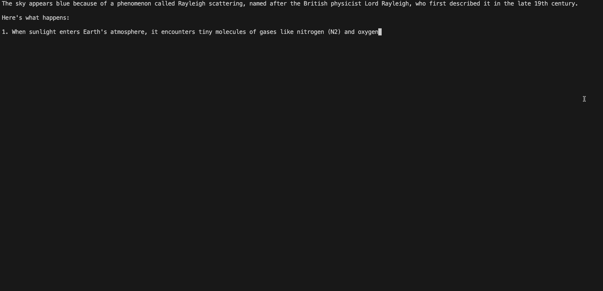

## Usage

### Maven

```xml
    <dependency>
        <groupId>io.github.glynch</groupId>
        <artifactId>jollama</artifactId>
        <version>0.1.0</version>
    </dependency>
```

### Gradle

```gradle
implementation 'io.github.glynch:jollama:0.1.0'
```


